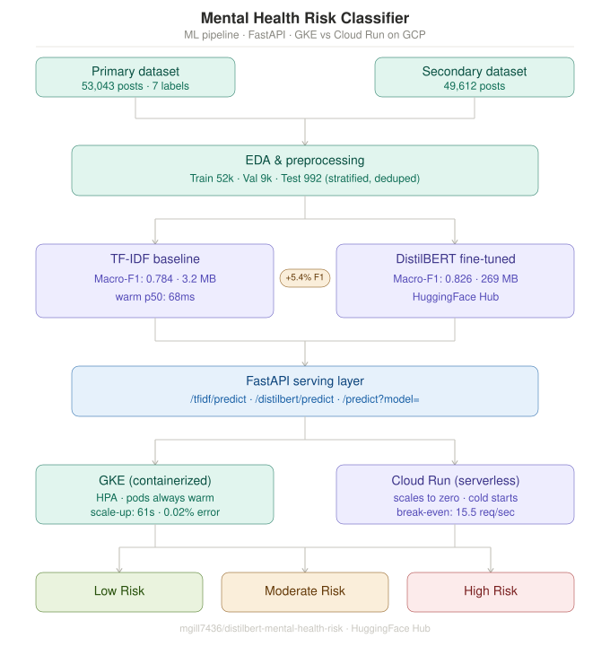

# Mental Health Risk Classifier
### Containerized vs. Serverless ML Inference on GCP

A 3-class mental health risk classifier comparing two cloud deployment architectures — **GKE** (containerized, self-orchestrated) vs **Cloud Run** (serverless containers) — for serving ML inference under varying traffic conditions.

> **Research prototype only.** Not intended for clinical use, diagnosis, or crisis response.



---

## Table of Contents

- [Overview](#overview)
- [Classification Task](#classification-task)
- [Results](#results)
- [Project Structure](#project-structure)
- [Setup & Usage](#setup--usage)
- [Notebooks](#notebooks)
- [Deployment](#deployment)
- [Load Testing](#load-testing)
- [Known Limitations](#known-limitations)
- [Team](#team)

---

## Overview

This project investigates the trade-offs between containerized and serverless deployment for ML inference under varying traffic conditions.

**Core research question:** How does deployment architecture interact with model complexity to determine serving performance, and what are the cost implications of each choice?

Two models are deployed on both platforms and benchmarked under identical traffic scenarios:

| Model | Size | Warm p50 | Cold start (isolated) | Purpose |
|---|---|---|---|---|
| TF-IDF + Logistic Regression | 3.2 MB | ~68–90ms | ~4,969ms | Lightweight deployment baseline |
| DistilBERT (fine-tuned) | 269 MB | ~300–480ms | ~25,661ms | High-accuracy transformer model |

**Platforms:**

| Platform | Type | Scaling | Cold starts |
|---|---|---|---|
| GKE (Google Kubernetes Engine) | Containerized | HPA — explicit, measurable | None — pods always warm |
| Cloud Run | Serverless containers | Google-managed — opaque | Yes — after idle period |

---

## Classification Task

**Input:** A social media post (text string)
**Output:** One of three mental health risk tiers

| Label | Risk Tier | Original Labels | Training Rows |
|---|---|---|---|
| 0 | Low Risk | Normal | 15,569 (29.9%) |
| 1 | Moderate Risk | Anxiety · Stress · Personality Disorder | 8,491 (16.3%) |
| 2 | High Risk | Depression · Suicidal · Bipolar | 28,003 (53.8%) |

---

## Results

### Model Performance (Test Set, n=992)

| Metric | TF-IDF + LogReg | DistilBERT | Δ |
|---|---|---|---|
| Accuracy | 0.790 | **0.836** | +0.045 |
| Macro-F1 | 0.784 | **0.826** | +0.043 |
| High Risk Recall | 0.77 | **0.86** | +0.09 |
| High Risk FN → Low Risk | 46 (9.3%) | **14 (2.8%)** | −70% |

### Steady Traffic (1 req/sec, warm instances)

| Configuration | p50 (ms) | p99 (ms) | Error % |
|---|---|---|---|
| GKE TF-IDF | 68 | 150 | 0.0% |
| GKE DistilBERT | 300 | 480 | 0.0% |
| Cloud Run TF-IDF | 90 | 170 | 0.0% |
| Cloud Run DistilBERT | 480 | 3,800* | 0.0% |

\*p99 reflects a single cold-start spike on the first request; warm p50 is 480ms.

### Burst Traffic (100 concurrent users)

| Configuration | p50 (ms) | p99 (ms) | RPS | Error % |
|---|---|---|---|---|
| GKE TF-IDF | 66 | 190 | 88.4 | **0.02%** |
| GKE DistilBERT | 61 | 30,000 | 25.6 | **94.07%** |
| Cloud Run TF-IDF | 70 | 270 | 77.8 | **0.0%** |
| Cloud Run DistilBERT | 1,300 | 9,400 | 23.6 | **0.0%** |

### Cold-Start (Isolated, dedicated single-model Cloud Run services)

| Model | Wall time | Cold overhead | Warm p50 | Cold/warm ratio |
|---|---|---|---|---|
| TF-IDF | 4,969ms | 4,958ms | 90ms | 55× |
| DistilBERT | 25,661ms | 22,329ms | 480ms | 53× |

> Cold overhead is dominated by Python process startup + framework import, not model size alone. Separate Cloud Run services per model prevent cold-start cost coupling.

### GKE Auto-Scaling

| Model | Baseline | Peak | Scale-up latency | Outcome |
|---|---|---|---|---|
| TF-IDF | 2 pods | 6 pods | 61s | Absorbed burst, 0.02% errors |
| DistilBERT | 1 pod | 2 pods | ~120s | Too slow — 94% errors |

### Cost Break-Even

Cloud Run is cheaper below **15.5 req/sec** sustained. GKE ($192.96/month fixed) is cheaper above.

### Hypotheses

| ID | Hypothesis | Result |
|---|---|---|
| H1 | DistilBERT cold start 5–10× worse than TF-IDF | Confirmed — 5.2× |
| H2 | Cloud Run cheaper below high req/sec threshold | Confirmed — break-even at 15.5 req/sec |
| H3 | p99 tail latency higher on Cloud Run under burst | Confirmed |
| H4 | DistilBERT GKE scale-up slower than TF-IDF | Confirmed — ~120s vs 61s |

---

## Project Structure

```
mental-health-classifier/
├── data/
│   ├── raw/
│   │   ├── primary/                    # CombinedData.csv + test set
│   │   └── secondary/                  # Kaggle secondary dataset
│   └── processed/                      # Generated by notebook 01
│       ├── train.csv                   # 52,063 rows
│       ├── val.csv                     # 9,188 rows
│       ├── test.csv                    # 992 rows (held out)
│       ├── class_weights.npy
│       └── label_map.json
├── models/
│   ├── baseline/                       # Generated by notebook 02
│   │   ├── pipeline.pkl                # sklearn Pipeline (3.2 MB)
│   │   └── baseline_metrics.json
│   └── distilbert/                     # Generated by notebook 03
│       └── distilbert-mental-health/   # HuggingFace model dir (269 MB)
├── notebooks/
│   ├── 01_eda_preprocessing.ipynb
│   ├── 02_baseline_model.ipynb
│   └── 03_distilbert_finetune.ipynb    # Run on Google Colab T4 GPU
├── api/
│   ├── main.py                         # FastAPI app (MODEL_TYPE env var)
│   ├── model_loader.py
│   ├── requirements.txt                # Full deps (torch + sklearn)
│   └── requirements_tfidf.txt          # Lean deps (sklearn only, no torch)
├── deployment/
│   ├── cloudrun/
│   │   └── Dockerfile                  # Both models, MODEL_TYPE=both
│   ├── kubernetes/
│   │   ├── Dockerfile.tfidf            # Lean image ~350MB
│   │   ├── Dockerfile.distilbert       # Full image ~2.4GB
│   │   ├── namespace.yaml
│   │   ├── ingress.yaml
│   │   ├── tfidf/                      # deployment.yaml + service.yaml + hpa.yaml
│   │   └── distilbert/                 # deployment.yaml + service.yaml + hpa.yaml
│   └── scripts/
│       ├── 00_setup_env.sh             # GCP config — edit PROJECT_ID here
│       ├── 01_build_push.sh            # Build + push all 3 Docker images
│       ├── 02_deploy_cloudrun.sh       # Deploy Cloud Run + smoke test
│       ├── 03_deploy_gke.sh            # Create cluster + apply manifests
│       └── 99_teardown.sh              # Delete all GCP resources
├── tests/
│   ├── locustfile.py                   # 4 user classes + cold-start probes
│   ├── 05_run_load_tests.sh            # Runs all scenarios
│   ├── 06_analyze_results.py           # Summary + scaling + cost analysis
│   └── 07_plot_results.py              # 6 report-ready charts
├── results/                            # CSVs, HTML reports, charts
└── docs/
    └── architecture_diagram.svg
```

---

## Setup & Usage

### Prerequisites

- Python 3.11+
- Docker Desktop (with buildx — required for Apple Silicon cross-compilation to linux/amd64)
- Google Cloud CLI (`gcloud`)
- `kubectl`

### Running the API Locally

```bash
cd api
pip install -r requirements.txt
uvicorn main:app --host 0.0.0.0 --port 8080 --reload
```

**Predict:**

```bash
curl -X POST "http://localhost:8080/predict?model=tfidf" \
  -H "Content-Type: application/json" \
  -d '{"text": "I have been feeling really low lately and cannot sleep"}'
```

**Sample response:**

```json
{
  "risk_tier": 2,
  "risk_label": "High Risk",
  "confidence": 0.93,
  "probabilities": {
    "Low Risk": 0.02,
    "Moderate Risk": 0.05,
    "High Risk": 0.93
  },
  "model": "distilbert",
  "latency_ms": 252.6
}
```

---

## Notebooks

### `01_eda_preprocessing.ipynb`
- Loads and merges primary + secondary datasets (~102k raw → 61k after dedup)
- Identifies 79.6% text overlap between sources (shared Kaggle upstream corpus)
- Maps 7 original labels → 3 risk tiers
- Two-mode text cleaning: `text_bert` (light) and `text_tfidf` (aggressive, stopwords removed)
- Saves processed splits to `data/processed/`

### `02_baseline_model.ipynb`
- TF-IDF (50k features, 1–2gram, sublinear TF) + Logistic Regression
- Test macro-F1: **0.784** | High Risk recall: **0.77**
- 5-fold CV: 0.8532 ± 0.0031
- Saves `pipeline.pkl` to `models/baseline/`

### `03_distilbert_finetune.ipynb` *(Google Colab T4 GPU)*
- Fine-tunes `distilbert-base-uncased` with weighted cross-entropy + WeightedRandomSampler
- Early stopping at epoch 3 of 5 (val macro-F1)
- Test macro-F1: **0.826** | High Risk recall: **0.86**
- High Risk FN→Low Risk reduced by **70%** (46 → 14)
- Model on HuggingFace: [`mgill7436/distilbert-mental-health-risk`](https://huggingface.co/mgill7436/distilbert-mental-health-risk)

---

## Deployment

### Quick start

```bash
# 1. Edit PROJECT_ID in deployment/scripts/00_setup_env.sh, then:
source deployment/scripts/00_setup_env.sh

# 2. Build and push all 3 Docker images to Artifact Registry
bash deployment/scripts/01_build_push.sh

# 3. Deploy Cloud Run (both models, ~3 min)
bash deployment/scripts/02_deploy_cloudrun.sh

# 4. Deploy GKE cluster + all manifests (~10 min)
bash deployment/scripts/03_deploy_gke.sh
```

### Apple Silicon (M1/M2/M3) — required

Cloud Run and GKE require `linux/amd64` images. Use buildx:

```bash
docker buildx build --platform linux/amd64 \
  -f deployment/cloudrun/Dockerfile \
  -t "${IMAGE_CLOUDRUN}" --push .
```

The deploy scripts handle this automatically via `01_build_push.sh`.

### Re-deploying after teardown

Images remain in Artifact Registry. Only the cluster and services need to be recreated:

```bash
source deployment/scripts/00_setup_env.sh
bash deployment/scripts/02_deploy_cloudrun.sh  
bash deployment/scripts/03_deploy_gke.sh       
```

### Teardown

```bash
bash deployment/scripts/99_teardown.sh
```

> Run teardown when finished. The GKE cluster costs ~$0.27/hr for 2 nodes even when idle.

---

## Load Testing

```bash
# Set URLs from deploy script output
export GKE_URL="http://<gke-ingress-ip>"
export CLOUDRUN_URL="https://<cloudrun-url>"

pip install locust
bash tests/05_run_load_tests.sh

# Analyze and plot results
python3 tests/06_analyze_results.py
python3 tests/07_plot_results.py
```

**Available Locust classes:**

| Class | Platform | Model | Scenario |
|---|---|---|---|
| `GkeTfIdf` | GKE | TF-IDF | Steady + burst |
| `GkeDistilBert` | GKE | DistilBERT | Steady + burst |
| `CloudRunTfIdf` | Cloud Run | TF-IDF | Steady + burst |
| `CloudRunDistilBert` | Cloud Run | DistilBERT | Steady + burst |
| `ColdStartProbeTfIdf` | Cloud Run (dedicated) | TF-IDF | Cold-start isolation |
| `ColdStartProbeDistilBert` | Cloud Run (dedicated) | DistilBERT | Cold-start isolation |

**Watch GKE auto-scaling live during burst tests:**

```bash
kubectl get hpa -n mh-classifier -w
```

---

## Known Limitations

- **Not for clinical use.** Research prototype trained on Reddit data only.
- **CPU inference on GCP.** DistilBERT warm p50 is ~300ms CPU vs ~15ms T4 GPU. Error rates under burst would improve significantly with GPU nodes.
- **Dataset overlap.** 79.6% shared corpus between primary and secondary datasets reduces effective unique training examples.
- **Multilingual bias.** Low Risk class dominated by non-English social media content, reducing DistilBERT Low Risk recall (0.76 vs TF-IDF 0.81).
- **Cold-start coupling.** The combined `MODEL_TYPE=both` Cloud Run service makes every cold start pay the full DistilBERT penalty (~25s). Use separate services per model in production.
- **GKE min-replicas=1 for DistilBERT.** Setting min-replicas=3 would eliminate the 94% burst error rate at additional idle cost.

