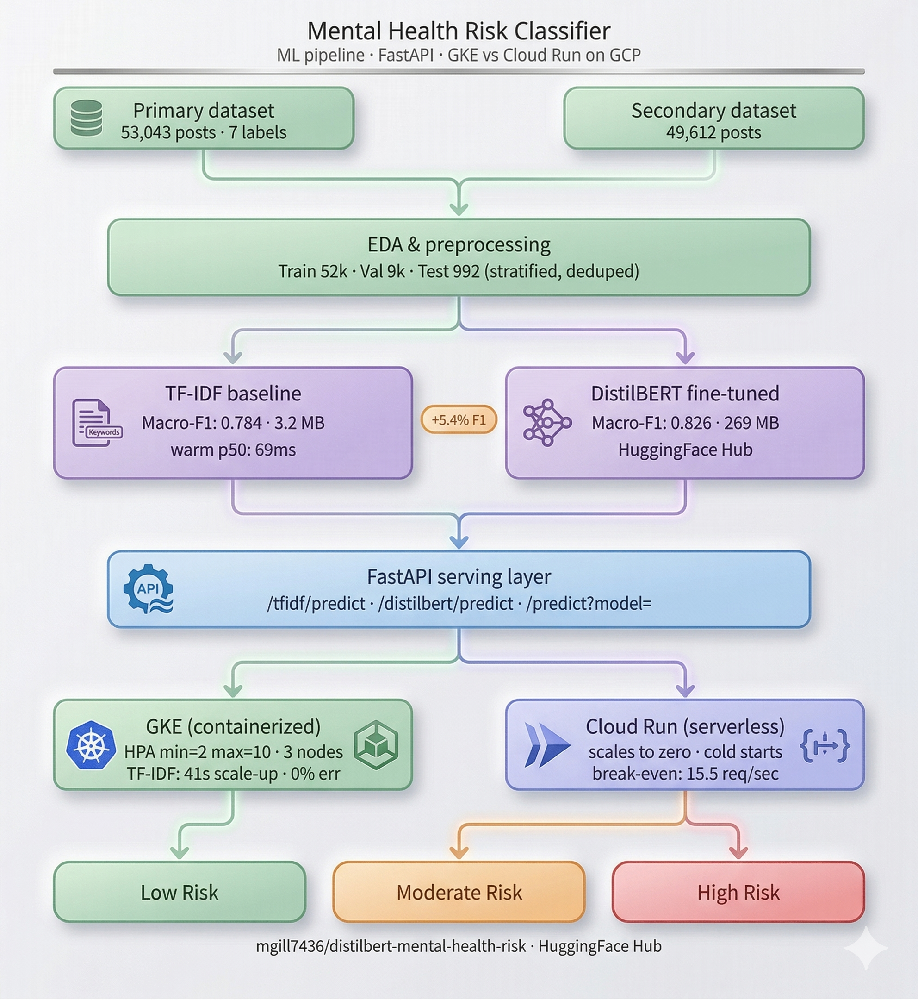
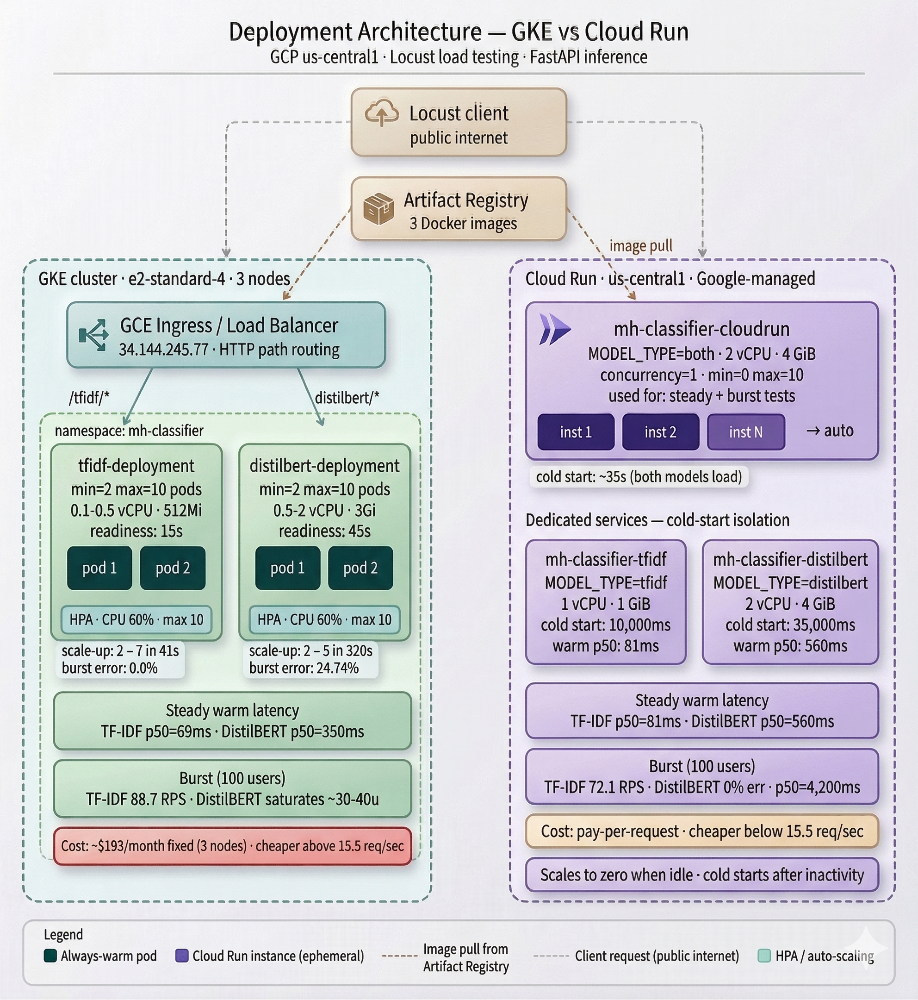

# Mental Health Risk Classifier
### Containerized vs. Serverless ML Inference on GCP

A 3-class mental health risk classifier comparing two GCP deployment architectures — **GKE** (containerized, HPA auto-scaling) vs **Cloud Run** (serverless containers) — for serving ML inference under varying traffic conditions.

> **Research prototype only.** Not intended for clinical use, diagnosis, or crisis response.




---

## Table of Contents

- [Overview](#overview)
- [Classification Task](#classification-task)
- [Results](#results)
- [Project Structure](#project-structure)
- [Setup & Usage](#setup--usage)
- [Notebooks](#notebooks)
- [Deployment](#deployment)
- [Load Testing](#load-testing)
- [Known Limitations](#known-limitations)
- [Team](#team)

---

## Overview

This project investigates the trade-offs between containerized and serverless deployment for ML inference under varying traffic conditions.

**Core research question:** How does deployment architecture interact with model complexity to determine serving performance, and what are the cost implications of each choice?

Two models are deployed on both platforms and benchmarked under identical traffic scenarios:

| Model | Size | Warm p50 | Cold start (isolated) | Purpose |
|---|---|---|---|---|
| TF-IDF + Logistic Regression | 3.2 MB | ~69ms | ~10,000ms | Lightweight deployment baseline |
| DistilBERT (fine-tuned) | 269 MB | ~350ms | ~35,000ms | High-accuracy transformer model |

**Platforms:**

| Platform | Type | Scaling | Cold starts |
|---|---|---|---|
| GKE (Google Kubernetes Engine) | Containerized | HPA — explicit, measurable | None — pods always warm |
| Cloud Run | Serverless containers | Google-managed — opaque | Yes — after idle period |

**GKE configuration:** Both models use equal scaling — min=2 pods, max=10 pods, CPU target 60%. 3-node cluster (e2-standard-4, 16 GiB each).

**Cloud Run configuration:** 2 vCPU, 4 GiB memory, concurrency=1 (one request per instance), scales to zero.

---

## Classification Task

**Input:** A social media post (text string)
**Output:** One of three mental health risk tiers

| Label | Risk Tier | Original Labels | Training Rows |
|---|---|---|---|
| 0 | Low Risk | Normal | 15,569 (29.9%) |
| 1 | Moderate Risk | Anxiety · Stress · Personality Disorder | 8,491 (16.3%) |
| 2 | High Risk | Depression · Suicidal · Bipolar | 28,003 (53.8%) |

---

## Results

### Model Performance (Test Set, n=992)

| Metric | TF-IDF + LogReg | DistilBERT | Δ |
|---|---|---|---|
| Accuracy | 0.790 | **0.836** | +0.045 |
| Macro-F1 | 0.784 | **0.826** | +0.043 |
| High Risk Recall | 0.77 | **0.86** | +0.09 |
| High Risk FN → Low Risk | 46 (9.3%) | **14 (2.8%)** | −70% |

---

### Steady Traffic (1 req/sec, warm instances)

| Configuration | p50 (ms) | p99 (ms) | Error % |
|---|---|---|---|
| GKE TF-IDF | 69 | 170 | 0.0% |
| GKE DistilBERT | 350 | 490 | 0.0% |
| Cloud Run TF-IDF | 81 | 15,000* | 0.0% |
| Cloud Run DistilBERT | 560 | 2,200* | 0.0% |

\*p99 reflects a single cold-start spike on the first request. Warm p50 values (81ms / 560ms) are representative of steady-state Cloud Run performance.

---

### Burst Traffic (100 concurrent users)

| Configuration | p50 (ms) | p99 (ms) | RPS | Error % |
|---|---|---|---|---|
| GKE TF-IDF | 70 | 180 | 88.7 | **0.0%** |
| GKE DistilBERT | 17,000 | 30,000 | 4.8 | **24.74%** |
| Cloud Run TF-IDF | 79 | 640 | 72.1 | **0.0%** |
| Cloud Run DistilBERT | 4,200 | 9,300 | 16.5 | **0.0%** |

GKE DistilBERT errors are HTTP 502 responses from the GCE load balancer when the pod pool is overwhelmed before scale-up completes. Cloud Run DistilBERT achieves zero errors by provisioning a separate instance per request, at the cost of higher sustained latency.

---

### Medium Load (20 concurrent users — saturation point)

| Configuration | p50 (ms) | p99 (ms) | RPS | Error % |
|---|---|---|---|---|
| GKE DistilBERT | 3,000 | 9,000 | 4.4 | **0.0%** |
| Cloud Run DistilBERT | 510 | 860 | 12.6 | **0.0%** |

GKE DistilBERT saturates between 20 and 100 users. Estimated saturation point: ~30–40 concurrent users based on throughput capacity of 2 pods at ~350ms inference = ~5.7 req/sec before queueing leads to timeouts.

---

### Cold-Start (Isolated, dedicated single-model Cloud Run services, 15+ min idle)

| Model | Wall time | Warm p50 | Cold/warm ratio |
|---|---|---|---|
| TF-IDF | 10,000ms | 81ms | 123× |
| DistilBERT | 35,000ms | 560ms | 63× |

Cold-start overhead is dominated by Python process startup + framework import (~5–10s shared by both models), not model size alone. DistilBERT adds ~20s for torch import and 269 MB model disk load on top. Using a combined Cloud Run service (both models loaded at startup) makes every cold start pay the full DistilBERT penalty even for TF-IDF queries — separate services per model are required to isolate cold-start costs.

---

### GKE Auto-Scaling (Burst Test)

| Model | Pods (start → peak) | Scale-up latency | Outcome |
|---|---|---|---|
| TF-IDF | 2 → 7 | 41 seconds | Absorbed burst — 0% errors |
| DistilBERT | 2 → 5 | 320 seconds | Too slow — 24.74% errors |

Scale-up latency is bounded below by the readiness probe delay: 15s per new TF-IDF pod, 45s per new DistilBERT pod. This reflects actual model load time and cannot be reduced without reducing model startup cost (quantisation, GPU nodes, or pre-loaded shared volumes).

---

### Cost Break-Even

Cloud Run is cheaper below **15.5 req/sec** sustained. GKE (~$193/month fixed) is cheaper above.

| Request rate | GKE | Cloud Run | Cheaper |
|---|---|---|---|
| 1 req/sec | $193/month | $12/month | Cloud Run (15×) |
| 15.5 req/sec | $193/month | $193/month | Break-even |
| 50 req/sec | $193/month | $622/month | GKE (3.2×) |
| 200 req/sec | $193/month | $2,488/month | GKE (12.9×) |

---

### Hypotheses

| ID | Hypothesis | Result |
|---|---|---|
| H1 | DistilBERT cold start 5–10× worse than TF-IDF | Partial — 3.5× (35s vs 10s). Directional finding holds; shared Python startup cost narrows the ratio. |
| H2 | Cloud Run cheaper below sustained high req/sec | Confirmed — break-even at 15.5 req/sec |
| H3 | p99 tail latency higher on Cloud Run under burst | Confirmed — CR TF-IDF p99=640ms vs GKE 180ms; CR DistilBERT p99=9,300ms |
| H4 | DistilBERT GKE scale-up slower than TF-IDF | Confirmed — 320s vs 41s (7.8×). Readiness probe asymmetry is the mechanism. |

---

## Project Structure

```
mental-health-classifier/
├── data/
│   ├── raw/
│   │   ├── primary/                    # CombinedData.csv + test set
│   │   └── secondary/                  # Kaggle secondary dataset
│   └── processed/                      # Generated by notebook 01
│       ├── train.csv                   # 52,063 rows
│       ├── val.csv                     # 9,188 rows
│       ├── test.csv                    # 992 rows (held out)
│       ├── class_weights.npy
│       └── label_map.json
├── models/
│   ├── baseline/                       # Generated by notebook 02
│   │   ├── pipeline.pkl                # sklearn Pipeline (3.2 MB)
│   │   └── baseline_metrics.json
│   └── distilbert/                     # Generated by notebook 03
│       └── distilbert-mental-health/   # HuggingFace model dir (269 MB)
├── notebooks/
│   ├── 01_eda_preprocessing.ipynb
│   ├── 02_baseline_model.ipynb
│   └── 03_distilbert_finetune.ipynb    # Run on Google Colab T4 GPU
├── api/
│   ├── main.py                         # FastAPI app (MODEL_TYPE env var)
│   ├── model_loader.py
│   ├── requirements.txt                # Full deps (torch + sklearn)
│   └── requirements_tfidf.txt          # Lean deps (sklearn only, no torch)
├── deployment/
│   ├── cloudrun/
│   │   └── Dockerfile                  # Both models, MODEL_TYPE=both
│   ├── kubernetes/
│   │   ├── Dockerfile.tfidf            # Lean image ~350 MB
│   │   ├── Dockerfile.distilbert       # Full image ~2.4 GB
│   │   ├── namespace.yaml
│   │   ├── ingress.yaml
│   │   ├── tfidf/                      # deployment.yaml + service.yaml + hpa.yaml
│   │   └── distilbert/                 # deployment.yaml + service.yaml + hpa.yaml
│   └── scripts/
│       ├── 00_setup_env.sh             # GCP config — edit PROJECT_ID here
│       ├── 01_build_push.sh            # Build + push all 3 Docker images
│       ├── 02_deploy_cloudrun.sh       # Deploy Cloud Run + smoke test
│       ├── 03_deploy_gke.sh            # Create cluster + apply manifests
│       └── 99_teardown.sh              # Delete all GCP resources
├── tests/
│   ├── locustfile.py                   # Locust user classes + cold-start probes
│   ├── 05_run_load_tests.sh            # Runs all 4 phases automatically
│   ├── 06_analyze_results.py           # Summary table + scaling + cost analysis
│   └── 07_plot_results.py              # Report-ready charts
├── results/                            # CSVs, HTML reports, charts
├── setup_env.sh                        # One-command environment setup
└── docs/
    └── architecture_diagram.svg
```

---

## Setup & Usage

### Prerequisites

- Python 3.11+
- Docker Desktop with buildx (required for Apple Silicon cross-compilation to `linux/amd64`)
- Google Cloud CLI (`gcloud`)
- `kubectl`

### Running the API Locally

```bash
cd api
pip install -r requirements.txt
uvicorn main:app --host 0.0.0.0 --port 8080 --reload
```

**Predict:**

```bash
curl -X POST "http://localhost:8080/predict?model=tfidf" \
  -H "Content-Type: application/json" \
  -d '{"text": "I have been feeling really low lately and cannot sleep"}'
```

**Sample response:**

```json
{
  "risk_tier": 2,
  "risk_label": "High Risk",
  "confidence": 0.93,
  "probabilities": {
    "Low Risk": 0.02,
    "Moderate Risk": 0.05,
    "High Risk": 0.93
  },
  "model": "distilbert",
  "latency_ms": 252.6
}
```

---

## Notebooks

### `01_eda_preprocessing.ipynb`
- Loads and merges primary + secondary datasets (~102k raw → 61k after dedup)
- Identifies 79.6% text overlap between sources (shared Kaggle upstream corpus)
- Maps 7 original labels → 3 risk tiers
- Two-mode text cleaning: `text_bert` (light) and `text_tfidf` (aggressive, stopwords removed)
- Saves processed splits to `data/processed/`

### `02_baseline_model.ipynb`
- TF-IDF (50k features, 1–2gram, sublinear TF) + Logistic Regression
- Test macro-F1: **0.784** | High Risk recall: **0.77**
- 5-fold CV: 0.8532 ± 0.0031
- Saves `pipeline.pkl` to `models/baseline/`

### `03_distilbert_finetune.ipynb` *(Google Colab T4 GPU)*
- Fine-tunes `distilbert-base-uncased` with weighted cross-entropy + WeightedRandomSampler
- Early stopping at epoch 3 of 5 (val macro-F1)
- Test macro-F1: **0.826** | High Risk recall: **0.86**
- High Risk FN→Low Risk reduced by **70%** (46 → 14)
- Model on HuggingFace: [`mgill7436/distilbert-mental-health-risk`](https://huggingface.co/mgill7436/distilbert-mental-health-risk)

---

## Deployment

### Quick start

```bash
# 1. Edit PROJECT_ID in deployment/scripts/00_setup_env.sh, then:
source deployment/scripts/00_setup_env.sh

# 2. Build and push all 3 Docker images to Artifact Registry
bash deployment/scripts/01_build_push.sh

# 3. Deploy Cloud Run (both models, ~3 min)
bash deployment/scripts/02_deploy_cloudrun.sh

# 4. Deploy GKE cluster + all manifests (~10 min)
bash deployment/scripts/03_deploy_gke.sh
```

### Apple Silicon (M1/M2/M3)

Cloud Run and GKE require `linux/amd64` images. Use buildx:

```bash
docker buildx build --platform linux/amd64 \
  -f deployment/cloudrun/Dockerfile \
  -t "${IMAGE_CLOUDRUN}" --push .
```

The deploy scripts handle this automatically via `01_build_push.sh`.

### Re-deploying after teardown

Docker images remain in Artifact Registry and do not need to be rebuilt:

```bash
source deployment/scripts/00_setup_env.sh
bash deployment/scripts/02_deploy_cloudrun.sh   # ~3 min
bash deployment/scripts/03_deploy_gke.sh        # ~10 min
```

### Teardown

```bash
bash deployment/scripts/99_teardown.sh
```

> Run teardown when finished. A 3-node GKE cluster costs ~$0.40/hr even when idle.

---

## Load Testing

### One-command environment setup

After deployment, run this once per terminal session:

```bash
source setup_env.sh
```

This exports `GKE_URL`, `CLOUDRUN_URL`, `TFIDF_SERVICE_URL`, and `DISTILBERT_SERVICE_URL` in one step.

### Running all tests

```bash
pip install locust
bash tests/05_run_load_tests.sh
```

The script runs four phases automatically:

| Phase | Scenario | Users | Duration | Purpose |
|---|---|---|---|---|
| A | Steady | 1 | 60s × 4 configs | Warm-path baseline latency |
| B1 | Burst | 100 | 100s × 4 configs | Auto-scaling, error rate, tail latency |
| B2 | Medium load | 20 | 120s × 2 configs | DistilBERT saturation point |
| C | Cold start | 1 | 60–300s × 2 probes | First-request wall time after 15 min idle |

### Analyzing results

```bash
python3 tests/06_analyze_results.py   # Summary table + scaling + cost
python3 tests/07_plot_results.py      # Charts saved to results/
```

### Available Locust classes

| Class | Platform | Model |
|---|---|---|
| `GkeTfIdf` | GKE | TF-IDF |
| `GkeDistilBert` | GKE | DistilBERT |
| `CloudRunTfIdf` | Cloud Run | TF-IDF |
| `CloudRunDistilBert` | Cloud Run | DistilBERT |
| `ColdStartProbeTfIdf` | Cloud Run dedicated | TF-IDF cold start |
| `ColdStartProbeDistilBert` | Cloud Run dedicated | DistilBERT cold start |

### Watch GKE auto-scaling live during burst tests

```bash
kubectl get hpa -n mh-classifier -w
```

---

## Known Limitations

- **Not for clinical use.** Research prototype trained on Reddit data only.
- **CPU inference on GCP.** DistilBERT warm p50 is ~350ms CPU vs ~15ms on a T4 GPU. Error rates under burst would improve significantly with GPU nodes and INT8 quantisation.
- **Dataset overlap.** 79.6% shared corpus between primary and secondary datasets reduces effective unique training examples.
- **Multilingual bias.** Low Risk class dominated by non-English social media content, reducing DistilBERT Low Risk recall (0.76 vs TF-IDF 0.81).
- **Cold-start coupling.** The combined `MODEL_TYPE=both` Cloud Run service makes every cold start pay the full DistilBERT penalty (~35s). Use separate services per model in production.
- **GKE DistilBERT saturation.** With min=2 pods, the system saturates at ~30–40 concurrent users. Setting min=5–6 pods would raise this ceiling but increases idle cost.
- **Single-region deployment.** No multi-region availability or failover tested.
- **Cold-start variability.** Cloud Run cold-start times depend on GCP VM slot availability and vary between measurements. Reported values represent full from-scratch cold starts.

---

## Team

Manpreet Gill · Illia Nasiri · Diana Kozich
CMPT 756 — Cloud Computing
